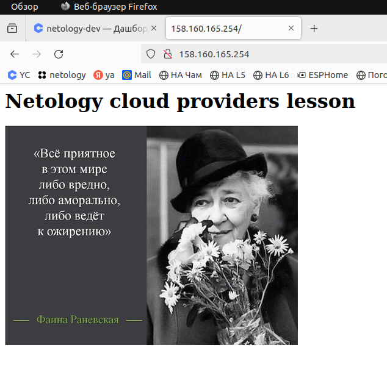
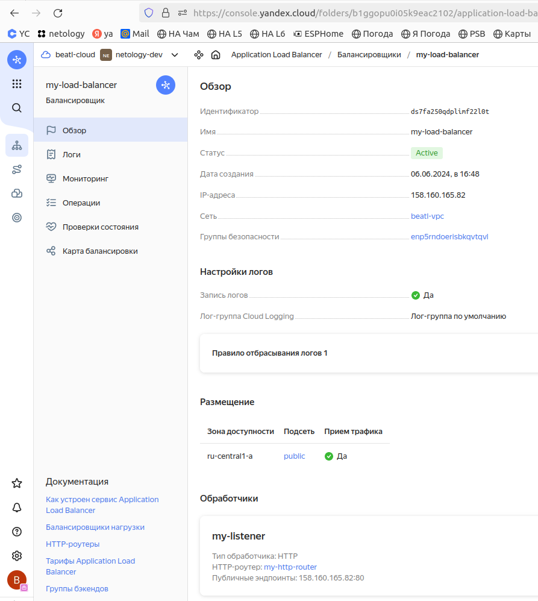
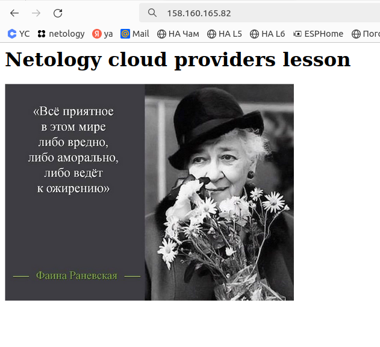

---


### Учебная группа DevOps-32

---

## Решение по домашнему заданию к занятию 15.2 «Вычислительные мощности. Балансировщики нагрузки»

Домашнее задание выполнялось в облаке Yandex Cloud

### Содержание

- [Общее описание](#description) 
- [Описание конфигурационных переменных](#variablesd)
- [Результат выполнения задания 1: Yandex cloud](#task1)
- [Исполнитель](#student)


---

###### #description
### Общее описание

Для выполнения домашнего задания создан два сценария terraform. 

Один - для тетстирования Network Load Balancer

Один - для тетстирования Application Load Balancer

Сценарии Terraform создают в облаке ресурсы в соответствии с домашним заданием.

Конфигурирование ресурсов осуществляется через определение переменных.

[Файлы сценария `terraform` для Network Load Balancer](./nlb/)

[Файлы сценария `terraform` для Application Load Balancer](./alb/)

---

###### #variablesd
### Описание конфигурационных переменных

Перед запуском сценария нужно откорректировать значения переменных в файле [variables.tf](nlb/variables.tf) 

##### Конфигурируемые переменные

| Name | Description                                                                                                                       | Type | Default                                                                                                                                                                                                                                                                                                         | Required |
|------|-----------------------------------------------------------------------------------------------------------------------------------|------|-----------------------------------------------------------------------------------------------------------------------------------------------------------------------------------------------------------------------------------------------------------------------------------------------------------------|:--------:|
| <a name="input_vpc_name"></a> [vpc\_name](#input\_vpc\_name) | VPC network name                                                                                                                  | `string` | `"beatl-vpc"`                                                                                                                                                                                                                                                                                                   |   yes    |
| <a name="input_subnet-props"></a> [subnet-props](#input\_subnet-props) | Параметры создаваемых подсетей. <br> <br> Для каждой подсети задается имя, cidr <br> и требуется ли привязывать к ней route_table | `map` | <pre>{<br>  "public": {<br>    "cidr": [<br>      "192.168.10.0/24"<br>    ],<br>    "name": "public",<br>    "route_table": false<br>  }<br>}</pre>                                                                                                                                                            |   yes    |
| <a name="input_vms_resources"></a> [vms\_resources](#input\_vms\_resources) | Параметры группы создаваемых виртуальных машин.                                                                                   | `map` | <pre>{<br>    "group_size": 3,<br>    "core_fraction": 20,<br>    "cores": 2,<br>    "disk_size": 50,<br>    "image_id": "fd8ris7enkv1ft2gp7fg",<br>    "ip_addr": "",<br>    "mem": 2,<br>    "name": "private-node",<br>    "nat": false,<br>    "subnet": "private"<br>  }</pre> |   yes    |

---

###### #task1
### Результат выполнения задания 1: Yandex Cloud

1. Bucket с картинкой создаётся сценарием в файле:
   [buckets](./nlb/buckets.tf)   

2. Cценарий для Network Load Balancer создает группу VM, Network Load Balancer и подключает группу VM к балансировщику

<details>
    <summary> Вывод terraform-apply для сценария Network Load Balancer...  </summary>

```
beatl@localhost:~/homeworks/clopro/15.2/nlb$ terraform apply

Terraform used the selected providers to generate the following execution plan. Resource actions are indicated with the following symbols:
  + create

Terraform will perform the following actions:

  # yandex_compute_instance_group.beatl-ig will be created
  + resource "yandex_compute_instance_group" "beatl-ig" {
      + created_at          = (known after apply)
      + deletion_protection = false
      + folder_id           = (sensitive value)
      + id                  = (known after apply)
      + instances           = (known after apply)
      + name                = "beatl-fixed-ig"
      + service_account_id  = (known after apply)
      + status              = (known after apply)

      + allocation_policy {
          + zones = [
              + "ru-central1-a",
            ]
        }

      + deploy_policy {
          + max_creating     = 0
          + max_deleting     = 0
          + max_expansion    = 0
          + max_unavailable  = 1
          + startup_duration = 0
          + strategy         = (known after apply)
        }

      + instance_template {
          + labels      = (known after apply)
          + metadata    = {
              + "ssh-keys"  = <<-EOT
                    ubuntu:ssh-ed25519 AAAAC3NzaC1lZDI1NTE5AAAAIFzIYA9F1G3dSQ6Ngnk+XSFESJgTn1Rx4ghJ0wv6WSvN beatl@OWEN
                EOT
              + "user-data" = <<-EOT
                    #cloud-config
                    users:
                      - name: beatl
                        groups: sudo
                        shell: /bin/bash
                        sudo: ['ALL=(ALL)NOPASSWD:ALL']
                        ssh-authorized-keys:
                          - ssh-ed25519 AAAAC3NzaC1lZDI1NTE5AAAAIFzIYA9F1G3dSQ6Ngnk+XSFESJgTn1Rx4ghJ0wv6WSvN beatl@OWEN
                    packages:
                      - net-tools       
                    runcmd:
                      - echo '<html> <body> <h1> Netology cloud providers lesson</h1>  </body> </html>' > /var/www/html/index.html
                      - service apache2 restart
                EOT
            }
          + platform_id = "standard-v3"

          + boot_disk {
              + device_name = (known after apply)
              + mode        = "READ_WRITE"

              + initialize_params {
                  + image_id    = "fd827b91d99psvq5fjit"
                  + size        = 50
                  + snapshot_id = (known after apply)
                  + type        = "network-hdd"
                }
            }

          + network_interface {
              + ip_address         = (known after apply)
              + ipv4               = true
              + ipv6               = (known after apply)
              + ipv6_address       = (known after apply)
              + nat                = false
              + network_id         = (known after apply)
              + security_group_ids = (known after apply)
              + subnet_ids         = (known after apply)
            }

          + resources {
              + core_fraction = 20
              + cores         = 2
              + memory        = 2
            }

          + scheduling_policy {
              + preemptible = true
            }
        }

      + load_balancer {
          + status_message           = (known after apply)
          + target_group_description = "Целевая группа Network Load Balancer"
          + target_group_id          = (known after apply)
          + target_group_name        = "beatl-tg"
        }

      + scale_policy {
          + fixed_scale {
              + size = 3
            }
        }
    }

  # yandex_iam_service_account.beatl-ig-sa will be created
  + resource "yandex_iam_service_account" "beatl-ig-sa" {
      + created_at  = (known after apply)
      + description = "Сервисный аккаунт для управления группой ВМ."
      + folder_id   = (known after apply)
      + id          = (known after apply)
      + name        = "beatl-ig-sa"
    }

  # yandex_iam_service_account_static_access_key.sa-static-key will be created
  + resource "yandex_iam_service_account_static_access_key" "sa-static-key" {
      + access_key           = (known after apply)
      + created_at           = (known after apply)
      + description          = "static access key for object storage"
      + encrypted_secret_key = (known after apply)
      + id                   = (known after apply)
      + key_fingerprint      = (known after apply)
      + secret_key           = (sensitive value)
      + service_account_id   = (known after apply)
    }

  # yandex_lb_network_load_balancer.beatl-lb will be created
  + resource "yandex_lb_network_load_balancer" "beatl-lb" {
      + created_at          = (known after apply)
      + deletion_protection = (known after apply)
      + folder_id           = (known after apply)
      + id                  = (known after apply)
      + name                = "network-load-balancer-1"
      + region_id           = (known after apply)
      + type                = "external"

      + attached_target_group {
          + target_group_id = (known after apply)

          + healthcheck {
              + healthy_threshold   = 2
              + interval            = 2
              + name                = "http"
              + timeout             = 1
              + unhealthy_threshold = 2

              + http_options {
                  + path = "/index.html"
                  + port = 80
                }
            }
        }

      + listener {
          + name        = "network-load-balancer-1-listener"
          + port        = 80
          + protocol    = (known after apply)
          + target_port = (known after apply)

          + external_address_spec {
              + address    = (known after apply)
              + ip_version = "ipv4"
            }
        }
    }

  # yandex_resourcemanager_folder_iam_member.editor will be created
  + resource "yandex_resourcemanager_folder_iam_member" "editor" {
      + folder_id = (sensitive value)
      + id        = (known after apply)
      + member    = (known after apply)
      + role      = "editor"
    }

  # yandex_storage_bucket.beatl-bucket will be created
  + resource "yandex_storage_bucket" "beatl-bucket" {
      + access_key            = (known after apply)
      + bucket                = "beatl-bucket"
      + bucket_domain_name    = (known after apply)
      + default_storage_class = (known after apply)
      + folder_id             = (known after apply)
      + force_destroy         = true
      + id                    = (known after apply)
      + secret_key            = (sensitive value)
      + website_domain        = (known after apply)
      + website_endpoint      = (known after apply)
    }

  # yandex_storage_object.beatl-buck-img will be created
  + resource "yandex_storage_object" "beatl-buck-img" {
      + access_key   = (known after apply)
      + acl          = "public-read"
      + bucket       = "beatl-bucket"
      + content_type = (known after apply)
      + id           = (known after apply)
      + key          = "image-1"
      + secret_key   = (sensitive value)
      + source       = "../images/7afbf86ade2cbd9fa149ef54efd4d954.jpg"
      + tags         = {
          + "test" = "true"
        }
    }

  # yandex_vpc_network.beatl-net will be created
  + resource "yandex_vpc_network" "beatl-net" {
      + created_at                = (known after apply)
      + default_security_group_id = (known after apply)
      + folder_id                 = (known after apply)
      + id                        = (known after apply)
      + labels                    = (known after apply)
      + name                      = "beatl-vpc"
      + subnet_ids                = (known after apply)
    }

  # yandex_vpc_security_group.beatl-web-sg will be created
  + resource "yandex_vpc_security_group" "beatl-web-sg" {
      + created_at = (known after apply)
      + folder_id  = (known after apply)
      + id         = (known after apply)
      + labels     = (known after apply)
      + network_id = (known after apply)
      + status     = (known after apply)

      + egress {
          + description       = "Permit ANY"
          + from_port         = -1
          + id                = (known after apply)
          + labels            = (known after apply)
          + port              = -1
          + protocol          = "ANY"
          + to_port           = -1
          + v4_cidr_blocks    = [
              + "0.0.0.0/0",
            ]
          + v6_cidr_blocks    = []
            # (2 unchanged attributes hidden)
        }

      + ingress {
          + description       = "Allow HTTP protocol"
          + from_port         = -1
          + id                = (known after apply)
          + labels            = (known after apply)
          + port              = 80
          + protocol          = "TCP"
          + to_port           = -1
          + v4_cidr_blocks    = [
              + "0.0.0.0/0",
            ]
          + v6_cidr_blocks    = []
            # (2 unchanged attributes hidden)
        }
      + ingress {
          + description       = "Allow HTTPS protocol"
          + from_port         = -1
          + id                = (known after apply)
          + labels            = (known after apply)
          + port              = 443
          + protocol          = "TCP"
          + to_port           = -1
          + v4_cidr_blocks    = [
              + "0.0.0.0/0",
            ]
          + v6_cidr_blocks    = []
            # (2 unchanged attributes hidden)
        }
      + ingress {
          + description       = "Health checks from NLB"
          + from_port         = -1
          + id                = (known after apply)
          + labels            = (known after apply)
          + port              = -1
          + predefined_target = "loadbalancer_healthchecks"
          + protocol          = "TCP"
          + to_port           = -1
          + v4_cidr_blocks    = []
          + v6_cidr_blocks    = []
            # (1 unchanged attribute hidden)
        }
    }

  # yandex_vpc_subnet.beatl-subnet["public"] will be created
  + resource "yandex_vpc_subnet" "beatl-subnet" {
      + created_at     = (known after apply)
      + folder_id      = (known after apply)
      + id             = (known after apply)
      + labels         = (known after apply)
      + name           = "public"
      + network_id     = (known after apply)
      + v4_cidr_blocks = [
          + "192.168.10.0/24",
        ]
      + v6_cidr_blocks = (known after apply)
      + zone           = "ru-central1-a"
    }

Plan: 10 to add, 0 to change, 0 to destroy.

Changes to Outputs:
  + Balancer_public_IP = [
      + {
          + external_address_spec = [
              + {
                  + address    = (known after apply)
                  + ip_version = "ipv4"
                },
            ]
          + internal_address_spec = []
          + name                  = "network-load-balancer-1-listener"
          + port                  = 80
          + protocol              = (known after apply)
          + target_port           = (known after apply)
        },
    ]

Do you want to perform these actions?
  Terraform will perform the actions described above.
  Only 'yes' will be accepted to approve.

  Enter a value: yes

yandex_vpc_network.beatl-net: Creating...
yandex_iam_service_account.beatl-ig-sa: Creating...
yandex_iam_service_account.beatl-ig-sa: Creation complete after 4s [id=ajeq7ne9knsiqmpllfbg]
yandex_resourcemanager_folder_iam_member.editor: Creating...
yandex_iam_service_account_static_access_key.sa-static-key: Creating...
yandex_vpc_network.beatl-net: Creation complete after 4s [id=enpci3sk8ekorb0cac4t]
yandex_vpc_subnet.beatl-subnet["public"]: Creating...
yandex_vpc_security_group.beatl-web-sg: Creating...
yandex_vpc_subnet.beatl-subnet["public"]: Creation complete after 1s [id=e9b11tfohs858uqjtjv2]
yandex_iam_service_account_static_access_key.sa-static-key: Creation complete after 1s [id=ajer7rovavb03pv45l29]
yandex_storage_object.beatl-buck-img: Creating...
yandex_storage_bucket.beatl-bucket: Creating...
yandex_storage_object.beatl-buck-img: Creation complete after 1s [id=image-1]
yandex_vpc_security_group.beatl-web-sg: Creation complete after 2s [id=enpqt28gub48vtq15pjb]
yandex_resourcemanager_folder_iam_member.editor: Creation complete after 4s [id=b1ggopu0i05k9eac2102/editor/serviceAccount:ajeq7ne9knsiqmpllfbg]
yandex_compute_instance_group.beatl-ig: Creating...
yandex_storage_bucket.beatl-bucket: Creation complete after 6s [id=beatl-bucket]
yandex_compute_instance_group.beatl-ig: Still creating... [10s elapsed]
yandex_compute_instance_group.beatl-ig: Still creating... [20s elapsed]
yandex_compute_instance_group.beatl-ig: Still creating... [30s elapsed]
yandex_compute_instance_group.beatl-ig: Still creating... [40s elapsed]
yandex_compute_instance_group.beatl-ig: Still creating... [50s elapsed]
yandex_compute_instance_group.beatl-ig: Still creating... [1m0s elapsed]
yandex_compute_instance_group.beatl-ig: Still creating... [1m10s elapsed]
yandex_compute_instance_group.beatl-ig: Still creating... [1m20s elapsed]
yandex_compute_instance_group.beatl-ig: Creation complete after 1m27s [id=cl1unga4edphvt8j94sa]
yandex_lb_network_load_balancer.beatl-lb: Creating...
yandex_lb_network_load_balancer.beatl-lb: Creation complete after 6s [id=enpn9a9l7r8ohg43fs0p]

Apply complete! Resources: 10 added, 0 changed, 0 destroyed.

Outputs:

Balancer_public_IP = toset([
  {
    "external_address_spec" = toset([
      {
        "address" = "158.160.165.254"
        "ip_version" = "ipv4"
      },
    ])
    "internal_address_spec" = toset([])
    "name" = "network-load-balancer-1-listener"
    "port" = 80
    "protocol" = "tcp"
    "target_port" = 80
  },
])
```

</details>

<details>
    <summary> Вывод консоли при проверке созданных VMs ...  </summary>

```
beatl@localhost:~/homeworks/clopro/15.2/nlb$ yc compute instance list
+----------------------+---------------------------+---------------+---------+-------------+---------------+
|          ID          |           NAME            |    ZONE ID    | STATUS  | EXTERNAL IP |  INTERNAL IP  |
+----------------------+---------------------------+---------------+---------+-------------+---------------+
| fhmg3giv39sobhhf20ti | cl1unga4edphvt8j94sa-ykyx | ru-central1-a | RUNNING |             | 192.168.10.18 |
| fhmrncj4jk93o47qjq3n | cl1unga4edphvt8j94sa-epov | ru-central1-a | RUNNING |             | 192.168.10.27 |
| fhmtonu4u40kel6hihf2 | cl1unga4edphvt8j94sa-asod | ru-central1-a | RUNNING |             | 192.168.10.21 |
+----------------------+---------------------------+---------------+---------+-------------+---------------+
```
</details>


<details>
    <summary> Результат проверки доступа из Интернет к балансировщику...  </summary>



</details>

4. Cценарий для Application Load Balancer создает группу VM, Application Load Balancer, Router и другие требуемые ресурсы  

<details>
    <summary> Вывод terraform-apply для сценария Application Load Balancer...  </summary>

```
beatl@localhost:~/homeworks/clopro/15.2/alb$ terraform apply

Terraform used the selected providers to generate the following execution plan. Resource actions are indicated with the following symbols:
  + create

Terraform will perform the following actions:

  # yandex_alb_backend_group.beatl-backend-group will be created
  + resource "yandex_alb_backend_group" "beatl-backend-group" {
      + created_at = (known after apply)
      + folder_id  = (known after apply)
      + id         = (known after apply)
      + name       = "my-backend-group"

      + http_backend {
          + http2            = true
          + name             = "beatl-http-backend"
          + port             = 80
          + target_group_ids = (known after apply)
          + weight           = 1

          + healthcheck {
              + interval = "5s"
              + timeout  = "30s"

              + http_healthcheck {
                  + path = "/"
                }
            }

          + load_balancing_config {
              + mode            = "ROUND_ROBIN"
              + panic_threshold = 50
            }
        }
    }

  # yandex_alb_http_router.beatl-router will be created
  + resource "yandex_alb_http_router" "beatl-router" {
      + created_at = (known after apply)
      + folder_id  = (known after apply)
      + id         = (known after apply)
      + labels     = {
          + "empty-label" = "s"
          + "tf-label"    = "tf-label-value"
        }
      + name       = "my-http-router"
    }

  # yandex_alb_load_balancer.beatl-alb-balancer will be created
  + resource "yandex_alb_load_balancer" "beatl-alb-balancer" {
      + created_at         = (known after apply)
      + folder_id          = (known after apply)
      + id                 = (known after apply)
      + log_group_id       = (known after apply)
      + name               = "my-load-balancer"
      + network_id         = (known after apply)
      + security_group_ids = (known after apply)
      + status             = (known after apply)

      + allocation_policy {
          + location {
              + disable_traffic = false
              + subnet_id       = (known after apply)
              + zone_id         = "ru-central1-a"
            }
        }

      + listener {
          + name = "my-listener"

          + endpoint {
              + ports = [
                  + 80,
                ]

              + address {
                  + external_ipv4_address {
                      + address = (known after apply)
                    }
                }
            }

          + http {
              + handler {
                  + allow_http10       = false
                  + http_router_id     = (known after apply)
                  + rewrite_request_id = false
                }
            }
        }

      + log_options {
          + discard_rule {
              + discard_percent     = 75
              + http_code_intervals = [
                  + "HTTP_2XX",
                ]
            }
        }
    }

  # yandex_alb_target_group.beatl-alb-tg will be created
  + resource "yandex_alb_target_group" "beatl-alb-tg" {
      + created_at = (known after apply)
      + folder_id  = (known after apply)
      + id         = (known after apply)
      + name       = "my-target-group"

      + target {
          + ip_address = (known after apply)
          + subnet_id  = (known after apply)
        }
      + target {
          + ip_address = (known after apply)
          + subnet_id  = (known after apply)
        }
      + target {
          + ip_address = (known after apply)
          + subnet_id  = (known after apply)
        }
    }

  # yandex_alb_virtual_host.beatl-virtual-host will be created
  + resource "yandex_alb_virtual_host" "beatl-virtual-host" {
      + http_router_id = (known after apply)
      + id             = (known after apply)
      + name           = "my-virtual-host"

      + route {
          + name = "my-route"

          + http_route {
              + http_match {
                  + path {
                      + exact = "/"
                    }
                }
              + http_route_action {
                  + backend_group_id = (known after apply)
                  + prefix_rewrite   = "/"
                  + timeout          = "10s"
                }
            }
        }
    }

  # yandex_compute_instance_group.beatl-ig will be created
  + resource "yandex_compute_instance_group" "beatl-ig" {
      + created_at          = (known after apply)
      + deletion_protection = false
      + folder_id           = (sensitive value)
      + id                  = (known after apply)
      + instances           = (known after apply)
      + name                = "beatl-fixed-ig"
      + service_account_id  = (known after apply)
      + status              = (known after apply)

      + allocation_policy {
          + zones = [
              + "ru-central1-a",
            ]
        }

      + deploy_policy {
          + max_creating     = 0
          + max_deleting     = 0
          + max_expansion    = 0
          + max_unavailable  = 1
          + startup_duration = 0
          + strategy         = (known after apply)
        }

      + instance_template {
          + labels      = (known after apply)
          + metadata    = {
              + "ssh-keys"  = <<-EOT
                    ubuntu:ssh-ed25519 AAAAC3NzaC1lZDI1NTE5AAAAIFzIYA9F1G3dSQ6Ngnk+XSFESJgTn1Rx4ghJ0wv6WSvN beatl@OWEN
                EOT
              + "user-data" = <<-EOT
                    #cloud-config
                    users:
                      - name: beatl
                        groups: sudo
                        shell: /bin/bash
                        sudo: ['ALL=(ALL)NOPASSWD:ALL']
                        ssh-authorized-keys:
                          - ssh-ed25519 AAAAC3NzaC1lZDI1NTE5AAAAIFzIYA9F1G3dSQ6Ngnk+XSFESJgTn1Rx4ghJ0wv6WSvN beatl@OWEN
                    packages:
                      - net-tools       
                    runcmd:
                      - echo '<html> <body> <h1> Netology cloud providers lesson</h1>  </body> </html>' > /var/www/html/index.html
                      - service apache2 restart
                EOT
            }
          + platform_id = "standard-v3"

          + boot_disk {
              + device_name = (known after apply)
              + mode        = "READ_WRITE"

              + initialize_params {
                  + image_id    = "fd827b91d99psvq5fjit"
                  + size        = 50
                  + snapshot_id = (known after apply)
                  + type        = "network-hdd"
                }
            }

          + network_interface {
              + ip_address         = (known after apply)
              + ipv4               = true
              + ipv6               = (known after apply)
              + ipv6_address       = (known after apply)
              + nat                = false
              + network_id         = (known after apply)
              + security_group_ids = (known after apply)
              + subnet_ids         = (known after apply)
            }

          + resources {
              + core_fraction = 20
              + cores         = 2
              + memory        = 2
            }

          + scheduling_policy {
              + preemptible = true
            }
        }

      + scale_policy {
          + fixed_scale {
              + size = 3
            }
        }
    }

  # yandex_iam_service_account.beatl-ig-sa will be created
  + resource "yandex_iam_service_account" "beatl-ig-sa" {
      + created_at  = (known after apply)
      + description = "Сервисный аккаунт для управления группой ВМ."
      + folder_id   = (known after apply)
      + id          = (known after apply)
      + name        = "beatl-ig-sa"
    }

  # yandex_iam_service_account_static_access_key.sa-static-key will be created
  + resource "yandex_iam_service_account_static_access_key" "sa-static-key" {
      + access_key           = (known after apply)
      + created_at           = (known after apply)
      + description          = "static access key for object storage"
      + encrypted_secret_key = (known after apply)
      + id                   = (known after apply)
      + key_fingerprint      = (known after apply)
      + secret_key           = (sensitive value)
      + service_account_id   = (known after apply)
    }

  # yandex_resourcemanager_folder_iam_member.editor will be created
  + resource "yandex_resourcemanager_folder_iam_member" "editor" {
      + folder_id = (sensitive value)
      + id        = (known after apply)
      + member    = (known after apply)
      + role      = "editor"
    }

  # yandex_storage_bucket.beatl-bucket will be created
  + resource "yandex_storage_bucket" "beatl-bucket" {
      + access_key            = (known after apply)
      + bucket                = "beatl-bucket"
      + bucket_domain_name    = (known after apply)
      + default_storage_class = (known after apply)
      + folder_id             = (known after apply)
      + force_destroy         = true
      + id                    = (known after apply)
      + secret_key            = (sensitive value)
      + website_domain        = (known after apply)
      + website_endpoint      = (known after apply)
    }

  # yandex_storage_object.beatl-buck-img will be created
  + resource "yandex_storage_object" "beatl-buck-img" {
      + access_key   = (known after apply)
      + acl          = "public-read"
      + bucket       = "beatl-bucket"
      + content_type = (known after apply)
      + id           = (known after apply)
      + key          = "image-1"
      + secret_key   = (sensitive value)
      + source       = "../images/7afbf86ade2cbd9fa149ef54efd4d954.jpg"
      + tags         = {
          + "test" = "true"
        }
    }

  # yandex_vpc_network.beatl-net will be created
  + resource "yandex_vpc_network" "beatl-net" {
      + created_at                = (known after apply)
      + default_security_group_id = (known after apply)
      + folder_id                 = (known after apply)
      + id                        = (known after apply)
      + labels                    = (known after apply)
      + name                      = "beatl-vpc"
      + subnet_ids                = (known after apply)
    }

  # yandex_vpc_security_group.beatl-web-sg will be created
  + resource "yandex_vpc_security_group" "beatl-web-sg" {
      + created_at = (known after apply)
      + folder_id  = (known after apply)
      + id         = (known after apply)
      + labels     = (known after apply)
      + network_id = (known after apply)
      + status     = (known after apply)

      + egress {
          + description       = "Permit ANY"
          + from_port         = -1
          + id                = (known after apply)
          + labels            = (known after apply)
          + port              = -1
          + protocol          = "ANY"
          + to_port           = -1
          + v4_cidr_blocks    = [
              + "0.0.0.0/0",
            ]
          + v6_cidr_blocks    = []
            # (2 unchanged attributes hidden)
        }

      + ingress {
          + description       = "Allow HTTP protocol"
          + from_port         = -1
          + id                = (known after apply)
          + labels            = (known after apply)
          + port              = 80
          + protocol          = "TCP"
          + to_port           = -1
          + v4_cidr_blocks    = [
              + "0.0.0.0/0",
            ]
          + v6_cidr_blocks    = []
            # (2 unchanged attributes hidden)
        }
      + ingress {
          + description       = "Allow HTTPS protocol"
          + from_port         = -1
          + id                = (known after apply)
          + labels            = (known after apply)
          + port              = 443
          + protocol          = "TCP"
          + to_port           = -1
          + v4_cidr_blocks    = [
              + "0.0.0.0/0",
            ]
          + v6_cidr_blocks    = []
            # (2 unchanged attributes hidden)
        }
      + ingress {
          + description       = "Health checks from NLB"
          + from_port         = -1
          + id                = (known after apply)
          + labels            = (known after apply)
          + port              = -1
          + predefined_target = "loadbalancer_healthchecks"
          + protocol          = "TCP"
          + to_port           = -1
          + v4_cidr_blocks    = []
          + v6_cidr_blocks    = []
            # (1 unchanged attribute hidden)
        }
    }

  # yandex_vpc_subnet.beatl-subnet["public"] will be created
  + resource "yandex_vpc_subnet" "beatl-subnet" {
      + created_at     = (known after apply)
      + folder_id      = (known after apply)
      + id             = (known after apply)
      + labels         = (known after apply)
      + name           = "public"
      + network_id     = (known after apply)
      + v4_cidr_blocks = [
          + "192.168.10.0/24",
        ]
      + v6_cidr_blocks = (known after apply)
      + zone           = "ru-central1-a"
    }

Plan: 14 to add, 0 to change, 0 to destroy.

Do you want to perform these actions?
  Terraform will perform the actions described above.
  Only 'yes' will be accepted to approve.

  Enter a value: yes

yandex_iam_service_account.beatl-ig-sa: Creating...
yandex_vpc_network.beatl-net: Creating...
yandex_alb_http_router.beatl-router: Creating...
yandex_alb_http_router.beatl-router: Creation complete after 2s [id=ds79huk5j1p58ngn7tr0]
yandex_iam_service_account.beatl-ig-sa: Creation complete after 3s [id=ajeqqnv5clf9q3d5g1ar]
yandex_iam_service_account_static_access_key.sa-static-key: Creating...
yandex_resourcemanager_folder_iam_member.editor: Creating...
yandex_vpc_network.beatl-net: Creation complete after 3s [id=enppf6la1k7eppeg9838]
yandex_vpc_subnet.beatl-subnet["public"]: Creating...
yandex_vpc_security_group.beatl-web-sg: Creating...
yandex_vpc_subnet.beatl-subnet["public"]: Creation complete after 1s [id=e9b702geidpnmphd2l71]
yandex_iam_service_account_static_access_key.sa-static-key: Creation complete after 2s [id=ajebduol04380k5dqahe]
yandex_storage_object.beatl-buck-img: Creating...
yandex_storage_bucket.beatl-bucket: Creating...
yandex_vpc_security_group.beatl-web-sg: Creation complete after 2s [id=enp5rndoerisbkqvtqvl]
yandex_alb_load_balancer.beatl-alb-balancer: Creating...
yandex_storage_object.beatl-buck-img: Creation complete after 1s [id=image-1]
yandex_resourcemanager_folder_iam_member.editor: Creation complete after 6s [id=b1ggopu0i05k9eac2102/editor/serviceAccount:ajeqqnv5clf9q3d5g1ar]
yandex_compute_instance_group.beatl-ig: Creating...
yandex_storage_bucket.beatl-bucket: Creation complete after 5s [id=beatl-bucket]
yandex_alb_load_balancer.beatl-alb-balancer: Still creating... [10s elapsed]
yandex_compute_instance_group.beatl-ig: Still creating... [10s elapsed]
yandex_alb_load_balancer.beatl-alb-balancer: Still creating... [20s elapsed]
yandex_compute_instance_group.beatl-ig: Still creating... [20s elapsed]
yandex_alb_load_balancer.beatl-alb-balancer: Still creating... [30s elapsed]
yandex_compute_instance_group.beatl-ig: Still creating... [30s elapsed]
yandex_alb_load_balancer.beatl-alb-balancer: Still creating... [40s elapsed]
yandex_compute_instance_group.beatl-ig: Still creating... [40s elapsed]
yandex_alb_load_balancer.beatl-alb-balancer: Still creating... [50s elapsed]
yandex_compute_instance_group.beatl-ig: Still creating... [50s elapsed]
yandex_alb_load_balancer.beatl-alb-balancer: Still creating... [1m0s elapsed]
yandex_compute_instance_group.beatl-ig: Still creating... [1m0s elapsed]
yandex_alb_load_balancer.beatl-alb-balancer: Still creating... [1m10s elapsed]
yandex_compute_instance_group.beatl-ig: Still creating... [1m10s elapsed]
yandex_alb_load_balancer.beatl-alb-balancer: Still creating... [1m20s elapsed]
yandex_compute_instance_group.beatl-ig: Still creating... [1m20s elapsed]
yandex_alb_load_balancer.beatl-alb-balancer: Still creating... [1m30s elapsed]
yandex_compute_instance_group.beatl-ig: Still creating... [1m30s elapsed]
yandex_alb_load_balancer.beatl-alb-balancer: Still creating... [1m40s elapsed]
yandex_compute_instance_group.beatl-ig: Still creating... [1m40s elapsed]
yandex_alb_load_balancer.beatl-alb-balancer: Still creating... [1m50s elapsed]
yandex_compute_instance_group.beatl-ig: Still creating... [1m50s elapsed]
yandex_alb_load_balancer.beatl-alb-balancer: Still creating... [2m0s elapsed]
yandex_compute_instance_group.beatl-ig: Creation complete after 1m57s [id=cl1paeut58uk3dlbosq6]
yandex_alb_target_group.beatl-alb-tg: Creating...
yandex_alb_target_group.beatl-alb-tg: Creation complete after 0s [id=ds7evbn08df3j145rveg]
yandex_alb_backend_group.beatl-backend-group: Creating...
yandex_alb_backend_group.beatl-backend-group: Creation complete after 0s [id=ds7fna6lg0dtbms7ugi1]
yandex_alb_virtual_host.beatl-virtual-host: Creating...
yandex_alb_virtual_host.beatl-virtual-host: Creation complete after 2s [id=ds79huk5j1p58ngn7tr0/my-virtual-host]
yandex_alb_load_balancer.beatl-alb-balancer: Still creating... [2m10s elapsed]
yandex_alb_load_balancer.beatl-alb-balancer: Still creating... [2m20s elapsed]
yandex_alb_load_balancer.beatl-alb-balancer: Still creating... [2m30s elapsed]
yandex_alb_load_balancer.beatl-alb-balancer: Still creating... [2m40s elapsed]
yandex_alb_load_balancer.beatl-alb-balancer: Still creating... [2m50s elapsed]
yandex_alb_load_balancer.beatl-alb-balancer: Still creating... [3m0s elapsed]
yandex_alb_load_balancer.beatl-alb-balancer: Still creating... [3m10s elapsed]
yandex_alb_load_balancer.beatl-alb-balancer: Still creating... [3m20s elapsed]
yandex_alb_load_balancer.beatl-alb-balancer: Still creating... [3m30s elapsed]
yandex_alb_load_balancer.beatl-alb-balancer: Still creating... [3m40s elapsed]
yandex_alb_load_balancer.beatl-alb-balancer: Still creating... [3m50s elapsed]
yandex_alb_load_balancer.beatl-alb-balancer: Still creating... [4m0s elapsed]
yandex_alb_load_balancer.beatl-alb-balancer: Still creating... [4m10s elapsed]
yandex_alb_load_balancer.beatl-alb-balancer: Still creating... [4m20s elapsed]
yandex_alb_load_balancer.beatl-alb-balancer: Still creating... [4m30s elapsed]
yandex_alb_load_balancer.beatl-alb-balancer: Still creating... [4m40s elapsed]
yandex_alb_load_balancer.beatl-alb-balancer: Still creating... [4m50s elapsed]
yandex_alb_load_balancer.beatl-alb-balancer: Still creating... [5m0s elapsed]
yandex_alb_load_balancer.beatl-alb-balancer: Still creating... [5m10s elapsed]
yandex_alb_load_balancer.beatl-alb-balancer: Still creating... [5m20s elapsed]
yandex_alb_load_balancer.beatl-alb-balancer: Still creating... [5m30s elapsed]
yandex_alb_load_balancer.beatl-alb-balancer: Still creating... [5m40s elapsed]
yandex_alb_load_balancer.beatl-alb-balancer: Still creating... [5m50s elapsed]
yandex_alb_load_balancer.beatl-alb-balancer: Still creating... [6m0s elapsed]
yandex_alb_load_balancer.beatl-alb-balancer: Creation complete after 6m3s [id=ds7fa250qdplimf22l0t]

Apply complete! Resources: 14 added, 0 changed, 0 destroyed.
```

</details>

<details>
    <summary> Вывод консоли при проверке созданных VMs ...  </summary>

```
beatl@localhost:~/homeworks/clopro/15.2/alb$ yc compute instance list
+----------------------+---------------------------+---------------+---------+-------------+---------------+
|          ID          |           NAME            |    ZONE ID    | STATUS  | EXTERNAL IP |  INTERNAL IP  |
+----------------------+---------------------------+---------------+---------+-------------+---------------+
| fhm81vlu1quogtucbn9f | cl1paeut58uk3dlbosq6-ahik | ru-central1-a | RUNNING |             | 192.168.10.19 |
| fhmbf6e53303u1efbgq7 | cl1paeut58uk3dlbosq6-uful | ru-central1-a | RUNNING |             | 192.168.10.14 |
| fhmesebbu4rlqkrjm1ov | cl1paeut58uk3dlbosq6-uzaw | ru-central1-a | RUNNING |             | 192.168.10.20 |
+----------------------+---------------------------+---------------+---------+-------------+---------------+
```
</details>

<details>
    <summary> Скриншот созданного ALB...  </summary>



</details>

<details>
    <summary> Результат проверки доступа из Интернет к балансировщику...  </summary>



</details>

---

###### student
### Исполнитель

Сергей Жуков DevOps-32

---