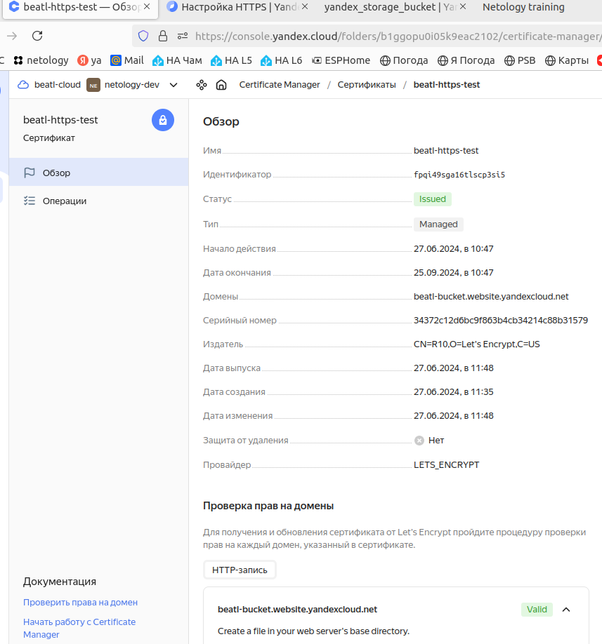

---


### Учебная группа DevOps-32

---

## Решение по домашнему заданию к занятию 15.3 «Безопасность в облачных провайдерах»

Домашнее задание выполнялось в облаке Yandex Cloud

### Содержание

- [Общее описание](#description) 
- [Результат выполнения задания 1: Yandex cloud](#task1)
- [Исполнитель](#student)


---

###### #description
### Общее описание

Для выполнения домашнего задания создан сценарий terraform. 

Сценарий Terraform создаёт в облаке ресурсы в соответствии с домашним заданием.

[Файлы сценария `terraform` для beatl-backet](./)

Объекты bucket-a шифруются симметричным ключом `beatl-key`.

Сертификат для доступа по HTTPS создается в YC и его id указывается в конфигурации bucket-a. 

---

###### #task1
### Результат выполнения задания 1: Yandex Cloud

<details>
    <summary> 1. Вывод terraform-apply ...  </summary>

```
beatl@localhost:~/homeworks/clopro/15.3$ terraform apply

Terraform used the selected providers to generate the following execution plan. Resource actions are indicated with the following symbols:
  + create

Terraform will perform the following actions:

  # yandex_iam_service_account.beatl-ig-sa will be created
  + resource "yandex_iam_service_account" "beatl-ig-sa" {
      + created_at  = (known after apply)
      + description = "Сервисный аккаунт для управления группой ВМ."
      + folder_id   = (known after apply)
      + id          = (known after apply)
      + name        = "beatl-ig-sa"
    }

  # yandex_iam_service_account_static_access_key.sa-static-key will be created
  + resource "yandex_iam_service_account_static_access_key" "sa-static-key" {
      + access_key           = (known after apply)
      + created_at           = (known after apply)
      + description          = "static access key for object storage"
      + encrypted_secret_key = (known after apply)
      + id                   = (known after apply)
      + key_fingerprint      = (known after apply)
      + secret_key           = (sensitive value)
      + service_account_id   = (known after apply)
    }

  # yandex_kms_symmetric_key.beatl-key will be created
  + resource "yandex_kms_symmetric_key" "beatl-key" {
      + created_at          = (known after apply)
      + default_algorithm   = "AES_128"
      + deletion_protection = false
      + description         = "netology learning"
      + folder_id           = (known after apply)
      + id                  = (known after apply)
      + name                = "lesson-15-3-key"
      + rotated_at          = (known after apply)
      + rotation_period     = "8760h"
      + status              = (known after apply)
    }

  # yandex_resourcemanager_folder_iam_member.editor will be created
  + resource "yandex_resourcemanager_folder_iam_member" "editor" {
      + folder_id = (sensitive value)
      + id        = (known after apply)
      + member    = (known after apply)
      + role      = "editor"
    }

  # yandex_storage_bucket.beatl-bucket will be created
  + resource "yandex_storage_bucket" "beatl-bucket" {
      + access_key            = (known after apply)
      + bucket                = "beatl-bucket"
      + bucket_domain_name    = (known after apply)
      + default_storage_class = (known after apply)
      + folder_id             = (known after apply)
      + force_destroy         = true
      + id                    = (known after apply)
      + secret_key            = (sensitive value)
      + website_domain        = (known after apply)
      + website_endpoint      = (known after apply)

      + anonymous_access_flags {
          + list = true
          + read = true
        }

      + https {
          + certificate_id = "fpqi49sga16tlscp3si5"
        }

      + server_side_encryption_configuration {
          + rule {
              + apply_server_side_encryption_by_default {
                  + kms_master_key_id = (known after apply)
                  + sse_algorithm     = "aws:kms"
                }
            }
        }

      + website {
          + error_document = "error.html"
          + index_document = "index.html"
        }
    }

  # yandex_storage_object.beatl-buck-err will be created
  + resource "yandex_storage_object" "beatl-buck-err" {
      + access_key   = (known after apply)
      + acl          = "private"
      + bucket       = "beatl-bucket"
      + content_type = (known after apply)
      + id           = (known after apply)
      + key          = "error.html"
      + secret_key   = (sensitive value)
      + source       = "./files/error.html"
    }

  # yandex_storage_object.beatl-buck-img will be created
  + resource "yandex_storage_object" "beatl-buck-img" {
      + access_key   = (known after apply)
      + acl          = "private"
      + bucket       = "beatl-bucket"
      + content_type = (known after apply)
      + id           = (known after apply)
      + key          = "image-1"
      + secret_key   = (sensitive value)
      + source       = "./images/7afbf86ade2cbd9fa149ef54efd4d954.jpg"
    }

  # yandex_storage_object.beatl-buck-index will be created
  + resource "yandex_storage_object" "beatl-buck-index" {
      + access_key   = (known after apply)
      + acl          = "private"
      + bucket       = "beatl-bucket"
      + content_type = (known after apply)
      + id           = (known after apply)
      + key          = "index.html"
      + secret_key   = (sensitive value)
      + source       = "./files/index.html"
    }

Plan: 8 to add, 0 to change, 0 to destroy.

Do you want to perform these actions?
  Terraform will perform the actions described above.
  Only 'yes' will be accepted to approve.

  Enter a value: yes

yandex_iam_service_account.beatl-ig-sa: Creating...
yandex_kms_symmetric_key.beatl-key: Creating...
yandex_kms_symmetric_key.beatl-key: Creation complete after 0s [id=abj0euhv09dhlgp3i18p]
yandex_iam_service_account.beatl-ig-sa: Creation complete after 2s [id=aje8nbvr95g26fte9q4q]
yandex_resourcemanager_folder_iam_member.editor: Creating...
yandex_iam_service_account_static_access_key.sa-static-key: Creating...
yandex_iam_service_account_static_access_key.sa-static-key: Creation complete after 1s [id=ajeo38lplmi9iu14r0q4]
yandex_storage_bucket.beatl-bucket: Creating...
yandex_resourcemanager_folder_iam_member.editor: Creation complete after 4s [id=b1ggopu0i05k9eac2102/editor/serviceAccount:aje8nbvr95g26fte9q4q]
yandex_storage_bucket.beatl-bucket: Still creating... [10s elapsed]
yandex_storage_bucket.beatl-bucket: Creation complete after 17s [id=beatl-bucket]
yandex_storage_object.beatl-buck-err: Creating...
yandex_storage_object.beatl-buck-img: Creating...
yandex_storage_object.beatl-buck-index: Creating...
yandex_storage_object.beatl-buck-index: Creation complete after 0s [id=index.html]
yandex_storage_object.beatl-buck-err: Creation complete after 0s [id=error.html]
yandex_storage_object.beatl-buck-img: Creation complete after 0s [id=image-1]

Apply complete! Resources: 8 added, 0 changed, 0 destroyed.
```

</details>

<details>
    <summary> 2. Сертификат для доступа по HTTPS...  </summary>



</details>

<details>
    <summary> 3. Результат проверки доступа из Интернет к сайту по HTTPS...  </summary>


</details>

---

###### student
### Исполнитель

Сергей Жуков DevOps-32

---