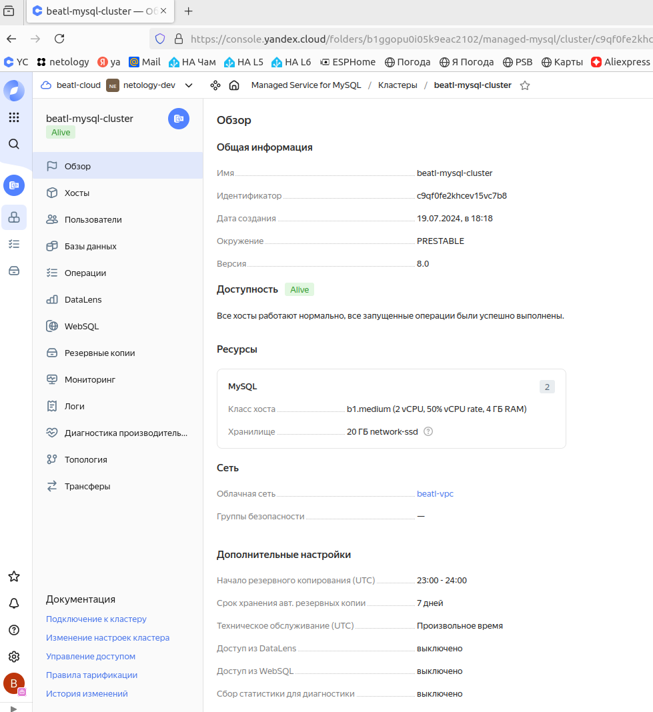
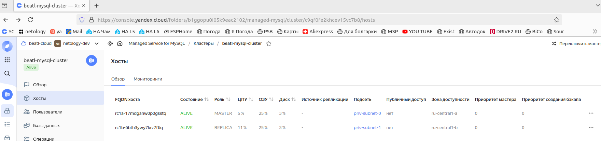
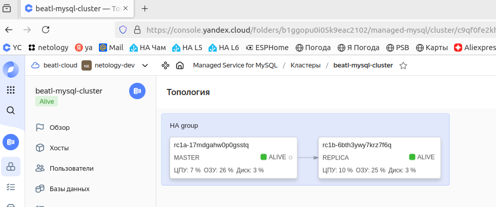
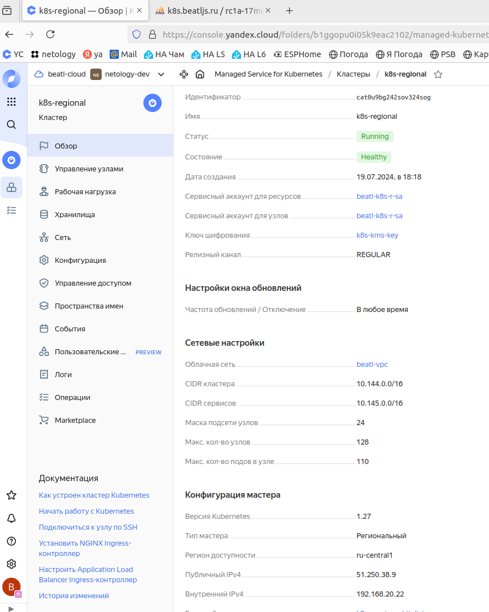
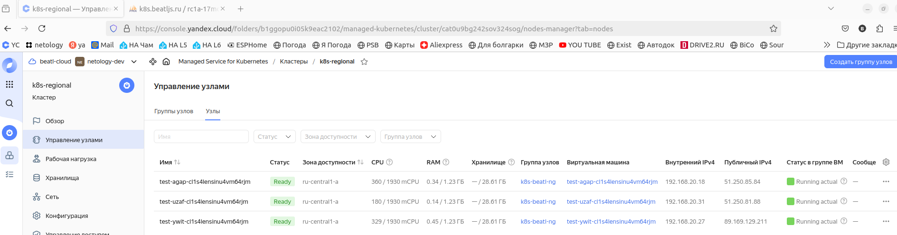
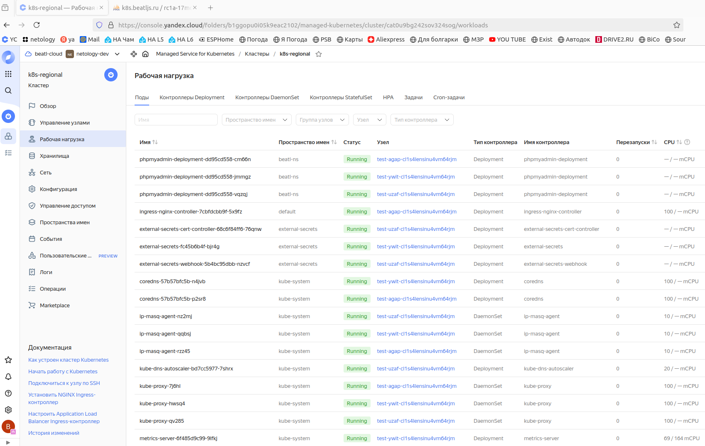
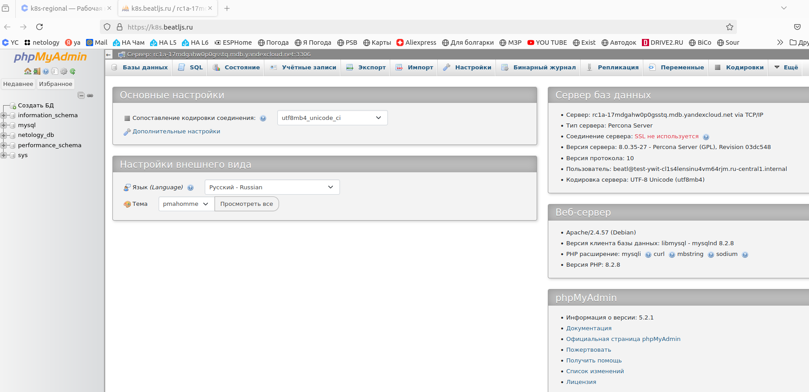

---

### Учебная группа DevOps-32

---

## Решение по домашнему заданию к занятию 15.4 «Кластеры. Ресурсы под управлением облачных провайдеров»

Домашнее задание выполнялось в облаке Yandex Cloud

### Содержание

- [Общее описание](#description) 
- [Описание конфигурационных переменных](#variablesd)
- [Результат выполнения задания 1: Yandex cloud](#task1)
- [Исполнитель](#student)

---

###### #description
### Общее описание

Для выполнения домашнего задания создан сценарий terraform. 

Сценарий Terraform создаёт в облаке ресурсы в соответствии с домашним заданием.

Конфигурирование ресурсов осуществляется через определение переменных.

[Файлы сценария `terraform`](./)

---

###### #variablesd
### Описание конфигурационных переменных

Перед запуском сценария, если требуется, нужно откорректировать значения переменных в файле: [variables.tf](./variables.tf) 

---

###### #task1
### Результат выполнения задания 1: Yandex Cloud

1. В соответствии с п.1 задания создается кластер в `Managed Service for MySQL`.

Кластер, база данных и пользователь создаются сценарием в файле: [mysql.tf](./mysql.tf) 

    
 Скриншот созданного кластера MySQL...  

    
 Скриншот хостов созданного кластера MySQL...  

    
 Скриншот топологии созданного кластера MySQL...  

---

2. В соответствии с п.2 задания создается кластер в `Managed Service for Kubernetes`.

Кластер создаётся сценарием в файле: [kuber.tf](./kuber.tf)

Группы безопасности и сервисные аккаунты с ролями создаются сценарием из файла: [security.tf](./security.tf)

Для доступа к кластеру используется свой домен `beatljs.ru`.

Для HTTPS доступа используется сертификат LetEncrypt созданный в предыдущем ДЗ.

Сертификат хранится в `Certificate Manager` и к кластеру подключается через `ext-secrets`

С публичным адресом из `LoadBalancer` автоматически создается запись в CloudDNS.  

    
 Скриншот созданного кластера Kubernetes...  

    
 Скриншот группы узлов созданного кластера ...  

    
 Скриншот подов созданного кластера ...  

    
 Скриншот доступа к кластеру MySQL из phpMyAdmin...  

---

###### student
### Исполнитель

Сергей Жуков DevOps-32

---